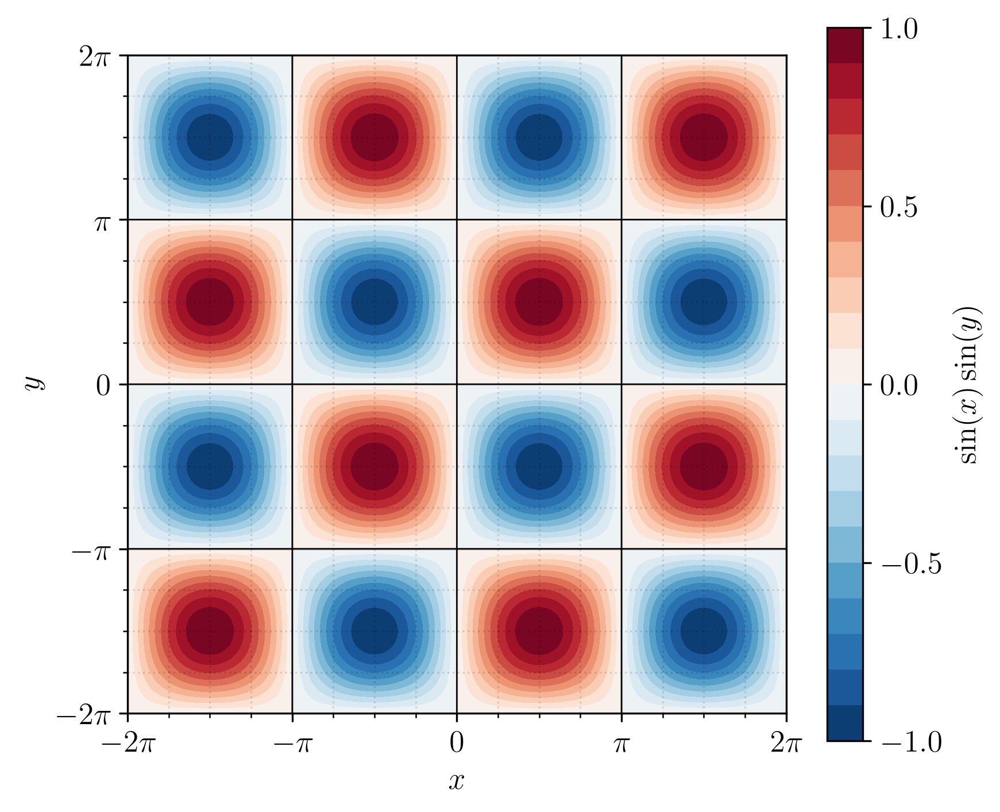
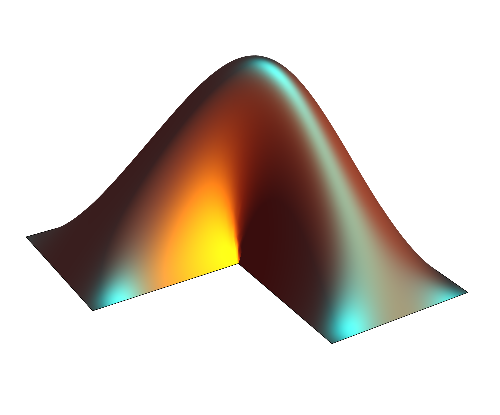
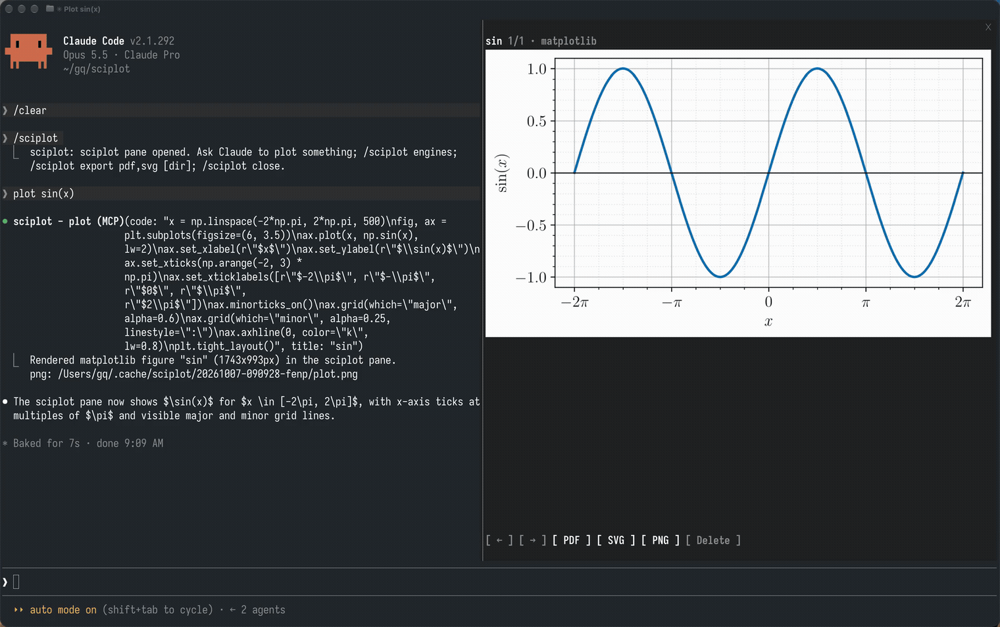

# sciplot

A [Claude Code](https://claude.com/claude-code) mod for scientific plots. Ask
Claude to plot something; it writes the code, sciplot runs it in the engine you pick and
shows the figure in a side pane, ready to export as PDF, SVG or PNG.

<p align="center">
  
  
</p>

<p align="center">
  
</p>

`plot sin(x)`, then the same figure in MATLAB and pgfplots, in a real Claude Code session. [Watch the full 30 s demo](docs/demo.mp4).

```
> plot sin(x)·sin(y) as a contour map
> render the MATLAB logo in Mathematica
> make it a 3D surface in plotly
```

## Install

From a Claude Code session:

```
/plugin install sciplot --marketplace vcdim/claude-code-sciplot
```

Then `/sciplot` opens the pane. The picture needs a terminal with the kitty
graphics protocol (Ghostty, kitty, WezTerm, iTerm2); elsewhere the pane falls
back to text and the exports still work.

## Engines

| Engine | Language | Cost |
|---|---|---|
| Python | matplotlib, plotly, seaborn (via `uv`) | free |
| R | base graphics, ggplot2 (LaTeX via tikzDevice) | free |
| LaTeX | TikZ / pgfplots | free |
| MATLAB | `.m` code (falls back to GNU Octave) | paid |
| Mathematica | Wolfram Language (`wolframscript`, or the free Wolfram Engine) | paid |

Engines are detected at session start; missing ones are hidden from Claude and
fall back to a free option. `/sciplot engines` shows what was found.

- **LaTeX text** by default when TeX is installed (matplotlib `usetex`, R
  `tikzDevice`, MATLAB's LaTeX interpreter), falling back to plain text if a
  label breaks it. Pass `latex: false` to turn it off.
- **300 dpi** PNG/JPG in every engine (plotly: 2× scale); PDF, SVG and EPS stay vector.

## Use

| | |
|---|---|
| `/sciplot` | open the pane |
| `/sciplot close` | close it |
| `/sciplot export pdf,svg [dir]` | export the current plot |
| `/sciplot delete` | move the current plot to the Trash |
| `/sciplot engines` | show which engines are installed |

Pane keys: `b` / `n` previous / next plot, `p` PDF, `s` SVG, `g` PNG, `d` delete;
for plotly, `i` live / static and `o` open in the browser.

**Live plotly.** A plotly figure is interactive right in the pane: drag to rotate
or pan, scroll to zoom, hover for values. A headless Chrome (your installed
Google Chrome, else Playwright's Chromium) draws the figure and the pane forwards
the mouse to it.

Each plot is kept in `~/.cache/sciplot/<timestamp>/` with its script and exports,
so any figure can be rerun or edited by hand.

## Develop

```
git clone https://github.com/vcdim/claude-code-sciplot && cd claude-code-sciplot
./run.sh install    # register this folder as a local marketplace and install
./run.sh validate   # claude plugin validate
./run.sh test       # claude plugin test
./run.sh engines    # list engine binaries on PATH
```

The plugin is a Claude Code hooks module: `hooks/register.tsx` registers the
`plot` tool, the `/sciplot` command and the pane; `scripts/` holds the per-engine
runners (`runner.py`, `runner.R`, `sciplot_runner.m`).

## License

[MIT](LICENSE)
